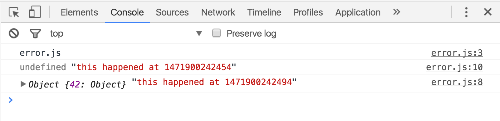
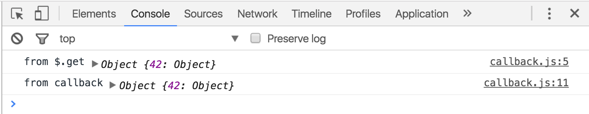

# Callbacks and Promises

## error.js

The following code will not execute the way you would like:
```javascript
let data
$.get('./data.json', function(response) {
  data = response
  console.log(response, 'this happened at ' + Date.now())
})
console.log(data, 'this happened at ' + Date.now())
```
The console.log at the bottom will execute before the console.log called by the $.get. Furthermore `data` will be `undefined`.

The large numbers console.logged represent time in milliseconds, in case you needed further proof that the consol.log on line 10 executed before the console.log on line 8. Also see that data was not defined when line 10's console.log executed. This is due to the asynchronous nature of $.get.

## Refactor with a callback - callback.js
Let's look at the following code - a refactor of the code we just saw:
```javascript
function getJson(callback) {
  $.get('./data.json', function(response) {
    console.log('from $.get', response)
    callback(response)
  })
}

function printData(data) {
  console.log('from callback', data)
}

getJson(printData)
```
We placed the $.get inside a function and we placed the outer console.log in a function as well. And when we call getJson we do so passing in a function. This function will execute after $.get returns a response, the proof is in Dev Tools console.

